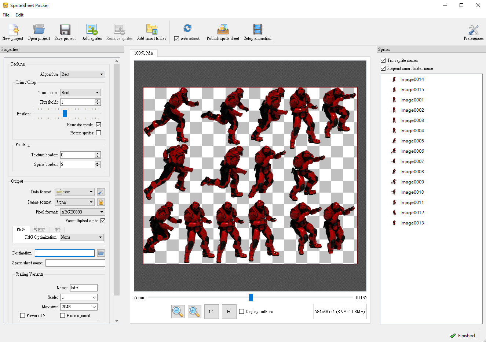
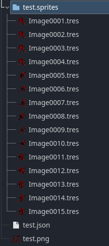

# Sprite Sheet Importer

This is a plugin for [Godot Engine](https://godotengine.org) to import
`AtlasTexture`s from the [SpriteSheet Packer](https://amakaseev.github.io/sprite-sheet-packer/)

**Note: This is compatible only with Godot 4.0 or later.**

## Installation

Download or clone this repository and copy the contents of the
`addons` folder to your own project's `addons` folder.

Important: Enable the plugin on the Project Settings.

## Features

* Import sprite sheets as AtlasTextures

## Usage (once the plugin is enabled)

1. Save your sprite sheets in your project folder as an json
2. Watch Godot import it automatically.

## License

[MIT License](LICENSE). Copyright (c) 2024 rugia813

forked from snkkid99/SpriteSheetImporter_godot_plugin
